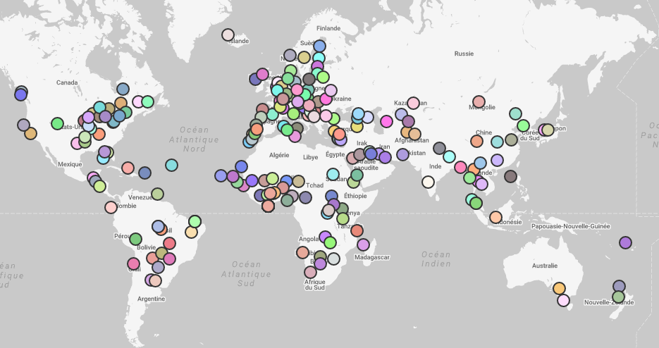

# Résultats élections 2017 pour les français résidant à l'étranger

This project displays a map with all the cities where French voters from abroad were able to vote, with the results for the first round on 23 April.

It was mainly a TypeScript training for me.




## Tech specification
- Typescript 2.1.6
- Sass 

## How to install

```bash
npm install
```

## How to run

```bash
gulp serve
```
**Need gulp to be globally installed*

## How to build

```bash
gulp build
```
**Need gulp to be globally installed*
